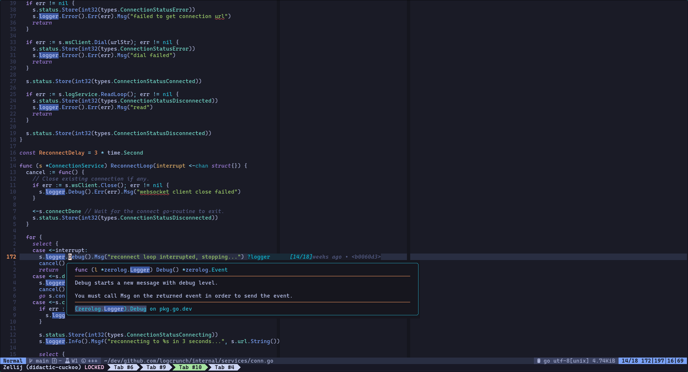
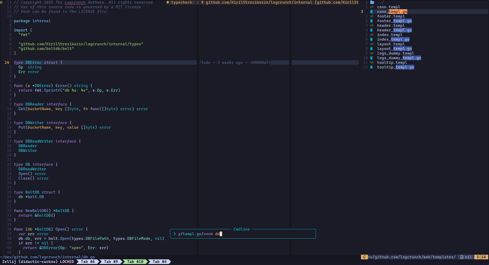

# nvim

Opinionated no-frills `nvim` configuration that just does the job.

Your nvim version:

- `0.11` - pin at `a093c2aea12d`. `0.10` works too I think)
- `0.12+` - latest commit or starting from `d5d160351d29`.

